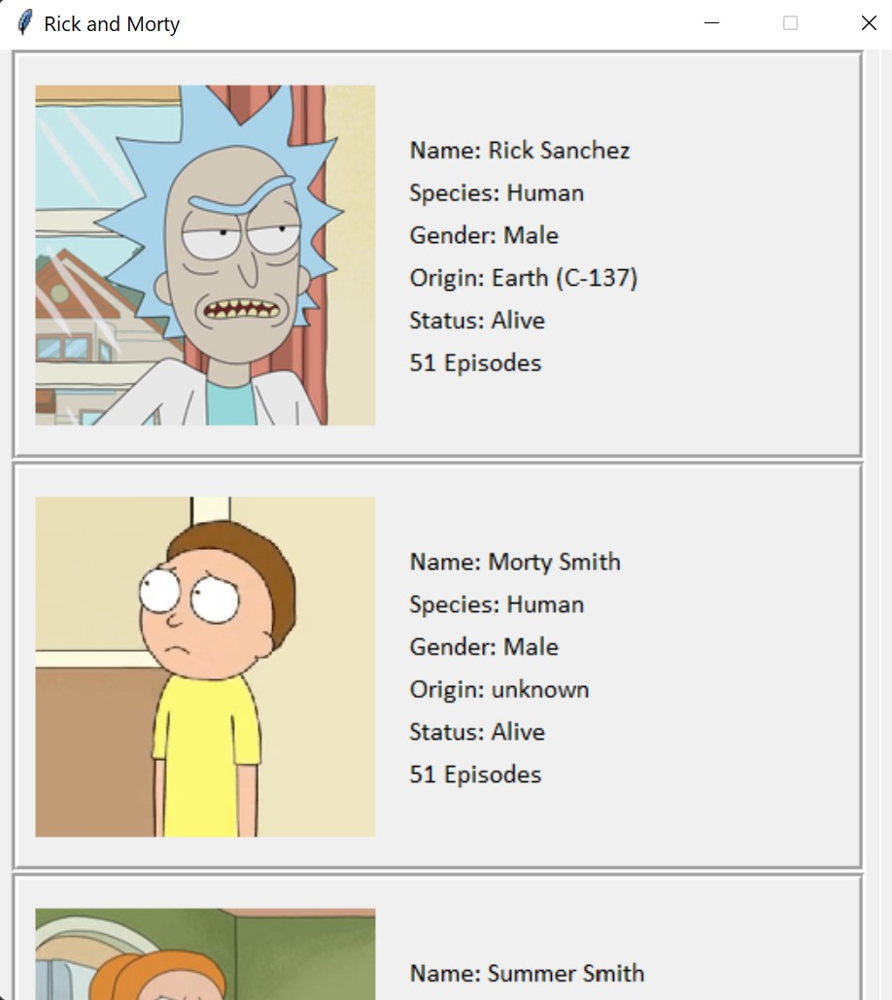

# Storing, Retrieving and Processing JSON data with Python

We will work with JSON data in python by learning what is an API and how we can access the data using HTTP requests in Python. 

We are going to retrieve the data and use TKinter module in python to develop a **desktop application** for browsing characters rolled in Rick and Morty series. 

Specifically, we explore how JSON API works and send an HTTP request to the server to retrieve the JSON data and fianlly develop a desktop application using python and TKinter.

The output product will look like this: 

  
